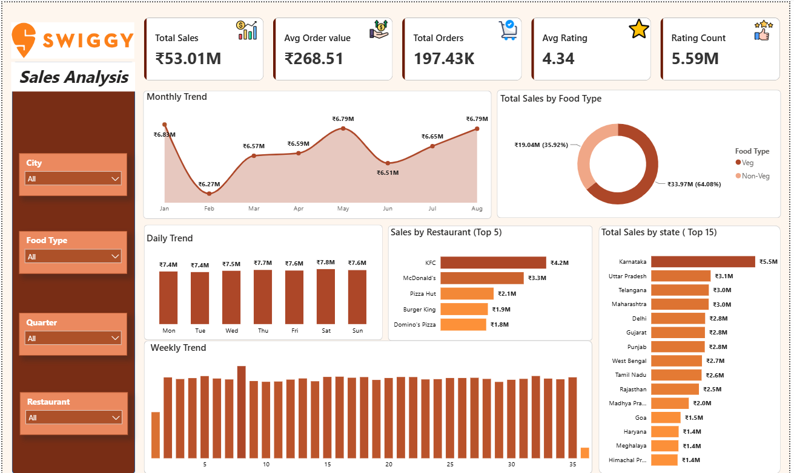

# 🍽️ Swiggy Sales Analysis Dashboard

An interactive **Swiggy Sales Analysis Dashboard** built using **Microsoft Power BI** to analyze sales performance, customer ratings, restaurant performance, food preferences, and geographical trends.

## 📊 Dashboard Preview

<p align="center">
  
</p>

## 🎯 Project Objective

The objective of this project is to transform Swiggy sales data into an interactive **Business Intelligence dashboard** and generate meaningful insights into sales performance and customer behavior.

The dashboard provides a clear view of key business metrics and helps identify trends across time, food types, restaurants, cities, and states.

## 📌 Key Performance Indicators

| KPI                    |   Value |
| ---------------------- | ------: |
| 💰 Total Sales         | ₹53.01M |
| 🛒 Total Orders        | 197.43K |
| 💵 Average Order Value | ₹268.51 |
| ⭐ Average Rating       |    4.34 |
| ⭐ Rating Count         |   5.39M |

## 📈 Dashboard Analysis

### 📅 Monthly Sales Trend

Analyzes monthly sales performance to identify high-performing and low-performing months.

### 🍗 Sales by Food Type

Compares **Veg** and **Non-Veg** sales to understand customer food preferences and their contribution to total revenue.

### 📆 Sales by Day of Week

Analyzes sales performance from **Monday to Sunday** to identify the strongest-performing days.

### 🏆 Top 5 Restaurants

Highlights the top-performing restaurants based on total sales and compares their contribution to overall revenue.

### 📍 Top 15 States

Identifies the highest-performing states based on total sales.

### 📊 Daily Sales Trend

Shows day-wise sales patterns to identify fluctuations and changes in daily performance.

## 🎛️ Interactive Filters

The dashboard includes interactive slicers for:

* **City**
* **Food Type**
* **Quarter**
* **Restaurant**

These filters allow users to dynamically explore different segments of the data.

## 🛠️ Tools & Technologies

* **Microsoft Power BI**
* **DAX**
* **Power Query**
* **Data Modeling**
* **Data Cleaning**
* **Data Visualization**
* **Business Intelligence**

## 🧮 DAX & Data Analysis

DAX was used to create calculated measures and columns for key business metrics, including:

* Total Sales
* Total Orders
* Average Order Value
* Average Rating
* Food Type Classification
* Monthly Sales
* Daily Sales
* Restaurant Sales
* State-wise Sales

## 💡 Key Insights

The dashboard helps analyze:

* Overall sales performance
* Monthly sales trends
* Veg vs Non-Veg revenue contribution
* Top-performing restaurants
* Top-performing states
* Day-wise sales patterns
* Customer rating performance
* Sales distribution across different business segments

## 📂 Repository Structure

```text
Swiggy-Sales-Analysis/
│
├── README.md
├── Swiggy_Sales_Report_Preview.png
└── swiggy.pbit
```

## 🚀 How to Use

1. Clone or download this repository.
2. Open `swiggy.pbit` using **Microsoft Power BI Desktop**.
3. Connect the required dataset if prompted.
4. Refresh the data.
5. Use the available slicers to interact with the dashboard.
6. Explore the different sales trends and business insights.

## 📚 Skills Demonstrated

**Data Cleaning → Data Modeling → DAX → KPI Development → Data Visualization → Interactive Dashboard Design → Business Analysis**

## 👨‍💻 Author

**Ujjwal Kumar Chauhan**

Aspiring Data Analyst with an interest in **Data Analytics, Business Intelligence, and Data Visualization**.

---

⭐ If you find this project useful, consider giving the repository a **star**!
